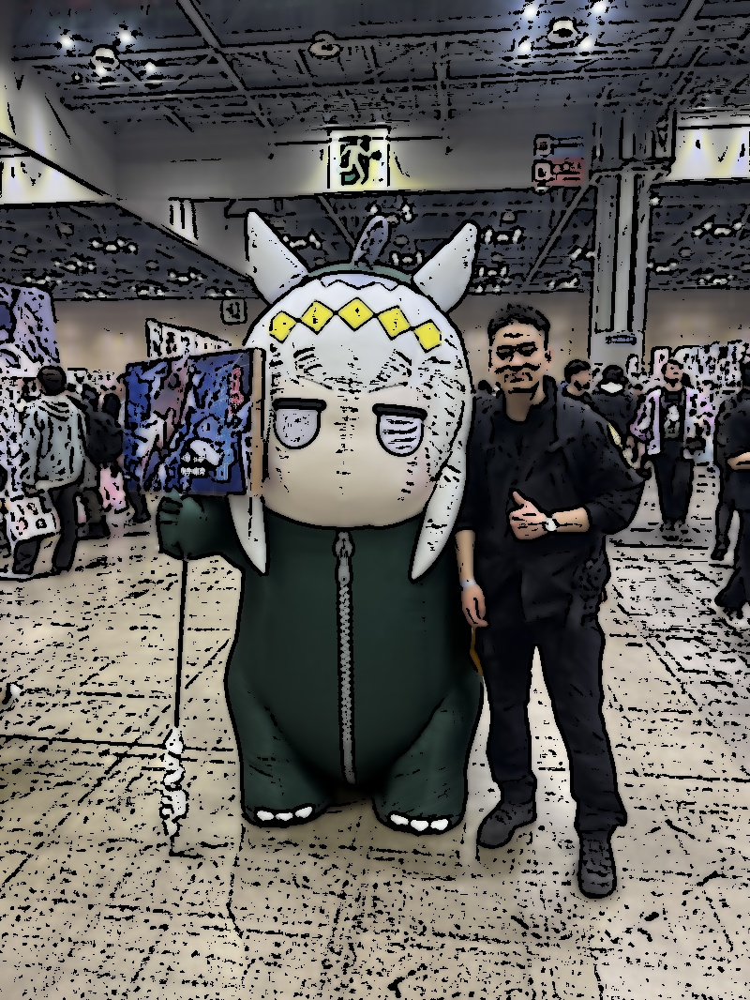
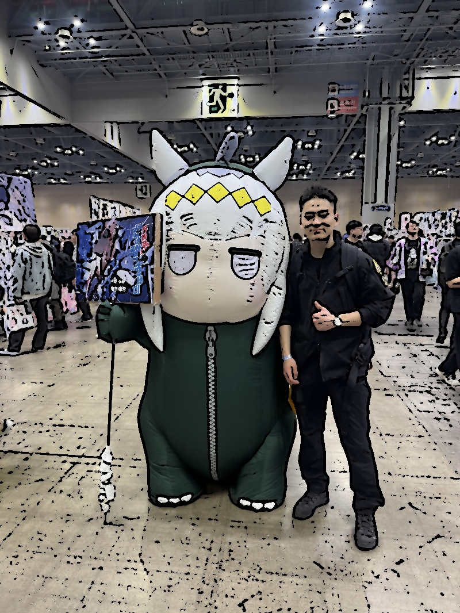

# 만화 스타일 이미지 변환기 🎨

OpenCV를 활용하여 실제 이미지를 만화 스타일로 변환하는 프로그램입니다.

---

## ✅ 기능

- 입력된 이미지를 만화 느낌으로 변환
- **강한(Strong)** 효과와 **약한(Soft)** 효과 두 가지 스타일 제공
- OpenCV 기반 이미지 처리 기술 사용 (엣지 검출 + 색상 평활화)

---

## 🖼️ 만화 스타일 예시

### ▶️ 강한 효과 (Strong)


> 색감이 진하고 윤곽선이 굵게 표현되어 애니메이션 스타일 느낌을 줍니다.

---

### ▶️ 약한 효과 (Soft)


> 원본과 유사한 색감을 유지하며 자연스럽게 윤곽선이 표현됩니다.

---

## 📌 잘 된 예시 vs 잘 안 된 예시

| 구분 | 설명 | 결과 |
|------|------|------|
| 잘 된 이미지 | 인물 중심, 배경이 단순함 | ✅ 윤곽선이 깔끔하고 효과가 잘 표현됨 |
| 잘 안 된 이미지 | 배경이 복잡하거나 조명이 어두움 | ⚠️ 윤곽선이 뭉개지거나 효과가 흐릿함 |

---

## ⚠️ 한계점

- 배경이 너무 복잡하거나 어두우면 엣지 검출이 부정확할 수 있음
- 이미지 크기가 너무 크면 처리 속도가 느려지므로 리사이즈가 필요함
- 밝기나 색감이 극단적인 경우 효과가 부자연스러울 수 있음
- 실시간 처리에는 부적합 (연산 속도 느림)

---

## 💻 실행 방법

```bash
pip install opencv-python
python Main.py
